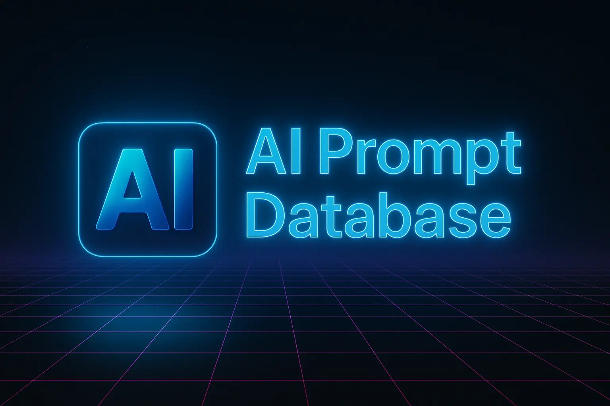

# AI Prompt Database

A curated, open-source collection of high-quality AI prompts for a wide range of use cases.  
Easily search, browse, and contribute your own prompts to empower creators, developers, educators, and AI enthusiasts.

---

## 🚀 Live Site

**Visit the project at:**  
[https://promptdatabase.org](https://promptdatabase.org)

---

## 📝 About the Project

The **AI Prompt Database** is a community-driven resource built to help you:

- Discover effective prompts for ChatGPT, Claude, and other AI systems
- Learn prompt engineering best practices
- Contribute and share your own creative or useful prompts
- Explore categorized and tagged prompt libraries

Whether you’re a developer, educator, content creator, or just curious about AI, this database is designed for you.

---

## ✨ Features

- 🔎 **Powerful Search & Filter** – Find prompts by category, difficulty, tags, and more.
- 🗃️ **Curated Content** – Each prompt is reviewed and organized for quality and usability.
- 📚 **Rich Metadata** – Every prompt includes description, author, use case, and source.
- 💡 **Easy Contribution** – Add your prompts via GitHub PRs or issues.
- 🌐 **Modern UI/UX** – Fast, accessible, and mobile-friendly design.
- 🛡️ **Open Source** – Free to use, modify, and extend under the MIT license.
- ⚡️ **PWA Support** – Installable for offline access.

---

⸻

🤝 Contributing

We welcome contributions of new prompts, bug fixes, improvements, and ideas!
Please see CONTRIBUTING.md for guidelines.
 • Open an Issue for suggestions or bug reports
 • Submit a Pull Request for prompt additions or enhancements

All participants are expected to follow our Code of Conduct.

⸻

📄 License

This project is licensed under the MIT License.
See the LICENSE.md file for details.

⸻

🌟 Acknowledgements
 • Built and maintained by Csaba Farkas (Sylenia)
 • Inspired by the prompt engineering community
 • Special thanks to all contributors and early users

⸻

📬 Contact

Questions or suggestions?
Open an issue on GitHub or email: <info@syleniainc.com>

⸻
